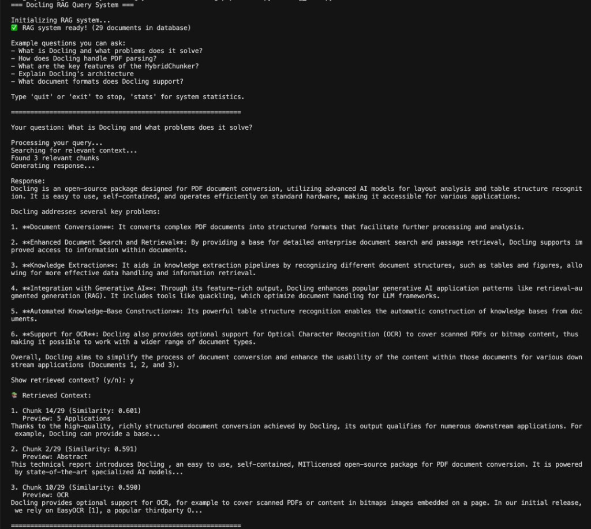
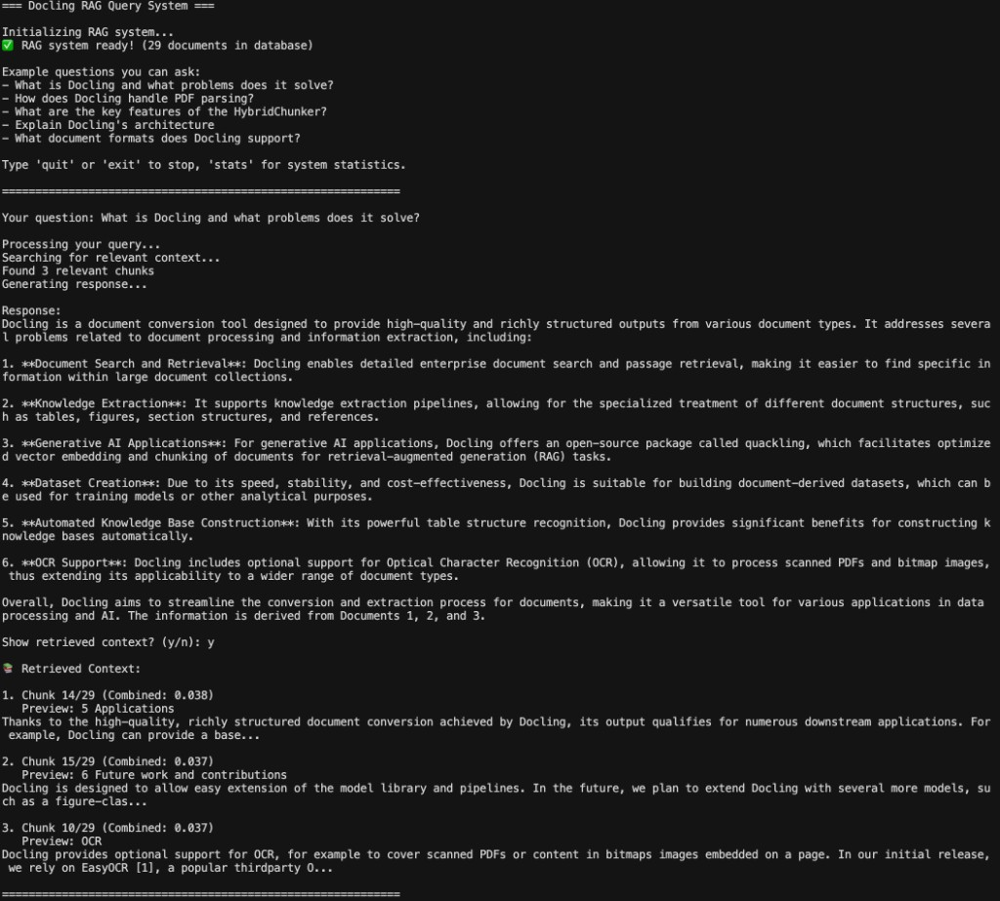
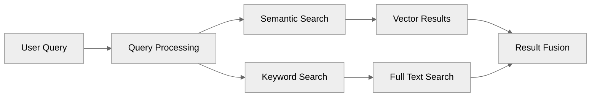

# End-to-End RAG Pipeline

This directory contains a complete **Retrieval-Augmented Generation (RAG)** pipeline you can run locally: **PostgreSQL + pgvector**, **OpenAI** embeddings and chat, and the **Docling** research paper as a sample corpus. It is set up to demo **two retrieval modes**: **similarity-only** (pure vector search) and **hybrid** (vectors + PostgreSQL full-text search, fused with **Reciprocal Rank Fusion**).

## Table of contents

- [Why this project](#why-this-project)
- [Live demo (CLI)](#live-demo-cli)
- [Project structure](#project-structure)
- [Architecture overview](#architecture-overview)
- [Prerequisites](#prerequisites)
- [Setup](#setup)
- [Usage](#usage)
- [Similarity vs hybrid retrieval](#similarity-vs-hybrid-retrieval)
- [Programmatic usage](#programmatic-usage)
- [How hybrid search works](#how-hybrid-search-works)
  - [Understanding hybrid search](#understanding-hybrid-search)
  - [Reciprocal Rank Fusion (RRF)](#reciprocal-rank-fusion-rrf)
  - [Understanding rank-based scoring](#understanding-rank-based-scoring)
  - [Full-text search in PostgreSQL](#full-text-search-in-postgresql)
  - [Strict vs flexible keyword modes](#strict-vs-flexible-keyword-modes)
  - [Zero-score results with keyword-only search](#important-behavior-zero-score-results-in-keyword-only-search)
  - [BM25: an alternative](#bm25-an-alternative-to-full-text-search)
- [Metadata filtering](#metadata-filtering)
- [Additional resources](#additional-resources)
- [Conclusion](#conclusion)

## Why this project

Vector databases have become essential infrastructure for modern AI applications, enabling semantic search, recommendation systems, and retrieval-augmented generation (RAG). While specialized vector databases exist, PostgreSQL with pgvector offers a compelling alternative that combines vector capabilities with the robustness of a mature relational database—**plus** built-in full-text search, which this project uses for hybrid retrieval.

### Why PostgreSQL for Vector Search

PostgreSQL with pgvector provides several advantages over specialized vector databases:

**Unified Data Platform**: Instead of managing separate databases for structured and vector data, PostgreSQL handles both seamlessly. This reduces operational complexity and enables powerful queries that combine vector similarity with traditional SQL filters.

**Production-Proven Reliability**: PostgreSQL brings decades of battle-tested reliability, ACID compliance, and robust backup/recovery mechanisms. Your vector data benefits from the same enterprise-grade features that protect critical business data.

**Cost Efficiency**: Open-source PostgreSQL eliminates licensing costs while providing performance that rivals commercial alternatives. The pgvector extension is also open-source and actively maintained.

**Flexible Deployment**: Whether you're running locally, on-premises, or in the cloud, PostgreSQL works everywhere. This flexibility extends from development laptops to massive production deployments.

## Live demo (CLI)

Run `python rag_chat.py` (from this directory, with your venv activated), ask a question, then choose **y** when prompted to show retrieved chunks.

| Mode | What you see in “retrieved context” |
|------|-------------------------------------|
| **Similarity** | Each chunk labeled with a **Similarity** score (cosine-style vector match). |
| **Hybrid** | Each chunk labeled with **Combined** (RRF fusion of semantic + keyword ranks). |

Toggle the mode in [`rag_chat.py`](rag_chat.py) by setting `is_hybrid = False` (similarity only) or `is_hybrid = True` (hybrid).

**Similarity-only retrieval** (example):



**Hybrid retrieval** (semantic + keyword, RRF combined scores):



## Project Structure

```text
rag-pipeline/
├── rag_chat.py                 # Interactive query interface
├── examples.py                 # Usage examples
├── build_vectordb.py           # Database setup script (run once)
├── README.md                   # This file
├── assets/                     # Demo screenshots for this README
└── rag/                        # Core implementation
    ├── __init__.py     
    ├── config.py               # Configuration settings
    ├── rag_system.py           # Main orchestrator
    ├── vector_store.py         # PGVector interface
    ├── document_processor.py   # Document chunking
    └── embedding_service.py    # Embedding generation
```

## Architecture Overview

The RAG pipeline consists of the following components:

1. **Document Processing**: Extract and chunk the Docling research paper (e.g. hybrid chunking via Docling)
2. **Embedding Generation**: Create embeddings using OpenAI's text-embedding-3-small
3. **Vector Storage**: Store embeddings (and text for FTS) in PostgreSQL with pgvector
4. **Retrieval**: **Similarity search** (pgvector) and/or **hybrid search** (vectors + PostgreSQL `tsvector` full-text search, merged with RRF) in [`rag/vector_store.py`](rag/vector_store.py), orchestrated by [`rag/rag_system.py`](rag/rag_system.py)
5. **Response Generation**: Use retrieved context to generate answers with OpenAI

## Prerequisites

- Docker and Docker Compose installed
- OpenAI API key
- Python 3.9+

## Setup

 **Start PGVector Database** (from the repository root):
```bash
cd pgvector-setup/docker
docker-compose up -d
cd ../../rag-pipeline
```

## Usage

### Step 1: Build the Vector Database

First, populate the vector database with the Docling paper:

```bash
python build_vectordb.py
```

This will:
- Download and process the Docling research paper
- Create 29 chunks using hybrid chunking
- Generate embeddings for each chunk
- Store everything in PGVector

### Step 2: Query the System

Run the interactive query interface:

```bash
python rag_chat.py
```

By default, [`rag_chat.py`](rag_chat.py) uses **hybrid** retrieval (`is_hybrid = True`). Set `is_hybrid = False` to demo **similarity-only** retrieval and compare rankings side by side.

### Step 3: Explore Examples

Study the example scripts to understand different usage patterns:

```bash
python examples.py
```

## Similarity vs hybrid retrieval

| | **Similarity (`is_hybrid=False`)** | **Hybrid (`is_hybrid=True`)** |
|---|-----------------------------------|------------------------------|
| **Mechanism** | Embed the query; rank chunks by vector distance / similarity | Run **both** vector search and PostgreSQL FTS; fuse ranked lists with **RRF** |
| **Scores in context** | `similarity` on each chunk | `combined_score` (and per-signal scores inside the LLM context) |
| **Best for** | Paraphrases, conceptual questions | Queries where **exact terms** (names, jargon) matter as well as meaning |

Implementation: `RAGSystem.retrieve_context(..., is_hybrid=...)` calls either `VectorStore.similarity_search` or `VectorStore.hybrid_search` ([`rag/rag_system.py`](rag/rag_system.py), [`rag/vector_store.py`](rag/vector_store.py)).

## Programmatic Usage

`RAGSystem.query` returns a **tuple** `(answer_string, list_of_chunk_dicts)`:

```python
from rag import RAGSystem

rag = RAGSystem()

# Similarity-only
answer, context = rag.query(
    "What is Docling and what are its main features?",
    is_hybrid=False,
)
print(answer)
for doc in context:
    print(doc["similarity"], doc["content"][:80])

# Hybrid (semantic + keyword, RRF)
answer, context = rag.query(
    "How does Docling handle tables?",
    is_hybrid=True,
)
print(answer)
for doc in context:
    print(doc["combined_score"], doc["content"][:80])
```

Optional arguments include `k`, `threshold` (similarity mode), and `metadata_filter` (hybrid path).

## How hybrid search works

Hybrid retrieval in this repo combines **semantic** and **keyword** search in SQL (see `VectorStore.hybrid_search`). It often outperforms pure vector search when users include specific tokens or when lexical overlap matters.



### Understanding Hybrid Search

Hybrid search addresses limitations of both semantic and keyword search:

**Semantic Search Strengths**:
- Understands context and meaning
- Handles synonyms and related concepts
- Works across languages
- Finds conceptually similar content

**Keyword Search Strengths**:
- Exact term matching
- Handles specific names, codes, or identifiers
- Predictable results
- Computationally efficient

By combining both approaches, hybrid search delivers superior results. For example, searching for "Italian recipes with tomato sauce" benefits from:
- Keyword matching for "Italian" and "tomato sauce"
- Semantic understanding to include "pasta marinara" or "pomodoro dishes"

### Reciprocal Rank Fusion (RRF)

Our implementation uses the [RRF algorithm implementation from Supabase](https://supabase.com/docs/guides/ai/hybrid-search#reciprocal-ranked-fusion-rrf) to combine results from different search methods. RRF is elegant and effective:

1. Each search method produces a ranked list
2. Items receive scores based on their rank: `1 / (k + rank)`
3. Scores are summed across methods
4. Final ranking uses combined scores

The smoothing constant `k` (default 50) prevents extreme scores for top-ranked items while maintaining meaningful differences.

### Understanding Rank-Based Scoring

The hybrid search implementation uses rank-based scoring rather than raw similarity scores. This approach has several important implications:

**Why Use Ranks Instead of Raw Scores?**
- **Normalization**: Raw similarity scores (like cosine similarity or inner product) can have different scales and distributions between semantic and keyword search
- **Consistency**: Rank-based scoring ensures consistent score ranges regardless of the underlying similarity metrics
- **Comparability**: Makes it easier to combine results from different search methods fairly

**How the Scores are Calculated:**
1. Each search method (semantic and keyword) produces its own ranked list
2. For each result, the rank score is calculated as: `1 / (k + rank)`
   - `k` is the smoothing constant (default 50)
   - `rank` is the position in the results (1-based)
3. The final score is a weighted sum of these rank scores

**Example Calculation from Real Output:**
```
Query: "database for storing vectors"

Top result from hybrid search:
- Ranked #1 in semantic search: score = 1/(50 + 1) = 0.0196
- Ranked #1 in keyword search: score = 1/(50 + 1) = 0.0196
- Combined score = 0.0196 + 0.0196 = 0.0392

Second result:
- Ranked #2 in semantic search: score = 1/(50 + 2) = 0.0192
- Ranked #3 in keyword search: score = 1/(50 + 3) = 0.0189
- Combined score = 0.0192 + 0.0189 = 0.0381

Third result:
- Ranked #2 in semantic search: score = 1/(50 + 2) = 0.0192
- Ranked #4 in keyword search: score = 1/(50 + 4) = 0.0185
- Combined score = 0.0185 + 0.0192 = 0.0377
```

**Why Scores Look Similar:**
- The `1/(k + rank)` formula creates a compressed score range
- With k=50, even rank 1 only gets a score of ~0.02
- This compression helps prevent any single method from dominating
- The small differences between scores are still meaningful for ranking

This rank-based approach ensures that:
- Results are fairly combined regardless of the underlying similarity metrics
- The relative importance of each search method is controlled by weights
- The final ranking is stable and interpretable

### Full-Text Search in PostgreSQL

PostgreSQL's full-text search provides powerful keyword matching capabilities:

**Text Processing**: Documents are processed into tokens, removing stop words and normalizing terms. This creates a `tsvector` that's optimized for searching.

**Example of Text to Token Conversion**:
```sql
-- Original text
SELECT to_tsvector('english', 'Machine learning models transform text into vectors');
-- Result: 'learn':2 'machin':1 'model':3 'text':5 'transform':4 'vector':7

-- Query processing
SELECT websearch_to_tsquery('english', 'machine learning');
-- Result: 'machin' & 'learn'

-- Notice how:
-- - "Machine" becomes "machin" (stemming)
-- - "learning" becomes "learn" (stemming)
-- - Common words like "into" are removed (stop words)
-- - Position information is preserved for ranking
```

**Query Flexibility**: Our implementation supports two modes:
- **Strict Mode**: Uses `websearch_to_tsquery` for Google-like syntax
- **Flexible Mode**: Custom logic that builds OR queries from available terms

**Performance**: GIN indexes on `tsvector` columns enable millisecond queries even on millions of documents.

### Strict vs Flexible Keyword Modes

**Strict Mode** (`websearch_to_tsquery`):
- Requires all terms to match
- Supports advanced syntax (phrases, exclusions)
- Better for precise, technical searches
- May return no results for conversational queries

**Flexible Mode** (custom implementation):
- Matches any term present in documents
- Extracts meaningful terms automatically
- Better for conversational, exploratory searches
- Always returns some results if possible

### Important Behavior: Zero-Score Results in Keyword-Only Search

When using the hybrid search implementation with `semantic_weight=0.0` (keyword search only), you may still receive results even when no documents match your keywords. These results will have a `fts_raw_score` of 0.0 but will still appear in the output.

**Why This Happens:**
- The implementation uses a FULL OUTER JOIN between keyword and semantic search results
- Even with `semantic_weight=0.0`, the semantic search CTE still executes and finds results
- Documents found only by semantic search get included with zero keyword scores
- This behavior ensures the query doesn't fail, but may return unexpected results

**Solutions:**
1. **Filter Results**: Check `fts_raw_score > 0` in your application logic
2. **Use Flexible Mode**: Switch to flexible mode which is more likely to find keyword matches
3. **Add Text Match Requirement**: Modify the query to only return documents that matched the keyword search
4. **Validate Query**: Check if your query terms exist in the document corpus before searching

This behavior is by design to ensure robust search functionality, but understanding it helps you implement appropriate filtering for your specific use case.

### BM25: An Alternative to Full-Text Search

While PostgreSQL's built-in full-text search is powerful, advanced RAG systems often use BM25 (Best Match 25) for keyword search. BM25 is a probabilistic ranking function that has become the standard for many search engines.

**What is BM25?**
- A ranking function based on the probabilistic information retrieval model
- Considers term frequency, inverse document frequency, and document length
- Generally provides better relevance ranking than traditional TF-IDF
- Particularly effective for longer documents and diverse content

**How BM25 Differs from PostgreSQL's Full-Text Search:**

**PostgreSQL Full-Text Search (Current Implementation)**
- Pros:
  - Built-in, no additional extensions needed
  - Good performance with GIN indexes
  - Supports language-specific features (stemming, stop words)
  - Integrated with PostgreSQL's query planner
- Cons:
  - Less sophisticated ranking than BM25
  - May not handle document length normalization as well
  - Limited to PostgreSQL's text search capabilities

**BM25**
- Pros:
  - More sophisticated relevance ranking
  - Better handling of term frequency and document length
  - Industry standard for many search applications
  - Can be tuned for specific use cases
- Cons:
  - Requires additional extensions (e.g., pg_bm25)
  - More complex to implement and maintain
  - May have higher computational overhead

**Implementing BM25 in PostgreSQL:**
While not covered in this guide, you can implement BM25 using extensions like `pg_search` or by building a custom solution. This is particularly relevant for:
- Large-scale RAG systems
- Applications requiring highly precise keyword matching
- Systems where search quality is critical
- Complex document collections with varying lengths

**Learn More About BM25:**
- [BM25 Wikipedia](https://en.wikipedia.org/wiki/Okapi_BM25) - Overview of the algorithm
- [pg_search by ParadeDB](https://www.paradedb.com/blog/introducing_search) - PostgreSQL extension for BM25
- [BM25 Paper](https://www.cl.cam.ac.uk/techreports/UCAM-CL-TR-356.pdf) - Original research paper

## Metadata Filtering

Metadata filtering adds another dimension to search, enabling precise control over results. Our implementation seamlessly integrates with both vector and keyword search.

### How Metadata Filtering Works

PostgreSQL's JSON type enables efficient filtering on arbitrary metadata:

1. **Storage**: Metadata is stored as JSON, allowing flexible schemas
2. **Indexing**: GIN indexes on JSON enable fast filtering
3. **Querying**: The `->` and `->>` operators extract and compare values
4. **Integration**: Filters apply within CTEs for optimal performance

### Implementation Details

The hybrid search function accepts metadata filters as a dictionary:

```python
results = search_engine.search(
    query="database tutorials",
    metadata_filter={"category": "database", "level": "beginner"}
)
```

This translates to SQL conditions that filter results before ranking, ensuring efficiency even with complex filters.

### Extending Metadata Filtering for Advanced Queries

The current implementation supports exact matches, but you may need comparison operators for dates or numeric values. Here's how to extend it:

**Current Implementation** (equality only):
```python
# This works for exact matches
metadata_filter={"category": "database", "level": "beginner"}
# Generates: metadata->>'category' = 'database' AND metadata->>'level' = 'beginner'
```

**Extended Implementation** for comparisons:
```python
# For date/number comparisons, you'd need to modify the filter format:
metadata_filter={
    "price": {"$lte": 100},
    "created_date": {"$gte": "2024-01-01"},
    "rating": {"$between": [4.0, 5.0]}
}

# In your search implementation, parse these operators:
for key, value in metadata_filter.items():
    if isinstance(value, dict):
        operator = list(value.keys())[0]
        if operator == "$lte":
            conditions.append(f"(metadata->>%s)::numeric <= %s")
        elif operator == "$gte":
            conditions.append(f"(metadata->>%s)::date >= %s")
        elif operator == "$between":
            conditions.append(f"(metadata->>%s)::numeric BETWEEN %s AND %s")
```

**Important Considerations**:
- **Type Casting**: JSON values are text, so cast to appropriate types (`::numeric`, `::date`)
- **Indexing**: For range queries, consider expression indexes:
  ```sql
  CREATE INDEX idx_metadata_price ON documents ((metadata->>'price')::numeric);
  ```
- **Validation**: Ensure proper error handling for invalid type conversions

### Best Practices for Metadata

**Schema Design**: While JSON is flexible, consistent metadata schemas improve performance and usability.

**Indexing Strategy**: Create GIN indexes for frequently filtered fields:
```sql
CREATE INDEX idx_metadata_category ON documents ((metadata->>'category'));
```

**Query Patterns**: Combine metadata filters with vector or hybrid search for powerful queries like "beginner Python tutorials similar to this example."

## Additional Resources

- [pgvector GitHub Repository](https://github.com/pgvector/pgvector) - Official documentation and examples
- [Supabase Vector Guides](https://supabase.com/docs/guides/ai) - Excellent tutorials and best practices
- [PostgreSQL Full-Text Search](https://www.postgresql.org/docs/current/textsearch.html) - Deep dive into text search
- [OpenAI Embeddings Guide](https://platform.openai.com/docs/guides/embeddings) - Understanding embedding models
- [Reciprocal Rank Fusion Paper](https://plg.uwaterloo.ca/~gvcormac/cormacksigir09-rrf.pdf) - Original RRF research

## Conclusion

PostgreSQL with pgvector provides a robust, production-ready platform for vector search applications. By combining vector capabilities with PostgreSQL's strengths in relational data, full-text search, and operational maturity, you can build sophisticated search systems that scale from prototype to production.